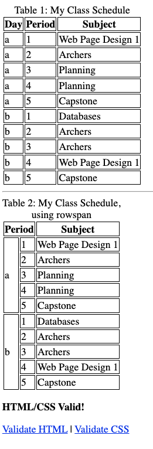

## Lesson Objectives
By the end of this lesson, you should:

- **Know**: 🍱 The parts of an HTML table
- **Understand**: 🚣‍♀️ The role of rowspan and columnspan attributes
- **Be Able To**: 🧑‍💻 Construct your own HTML table

## What We'll Do In Class

### Quiz

As promised, we'll start class with a quiz where you'll demonstrate that you've 
learned about tables from the reading.    

### Tables
Today, we'll work on tables in HTML. There is a table on the reading quiz, so
we'll write the code to create that one.

### vim resources
This will be the most intricate document we've written in vim so far, and you'll likely want to do some copy/pasting. [Here's a nice guide that should help you out](https://www.warp.dev/terminus/vim-copy-paste), and I always recommend periodically reviewing vimtutor to pick up new tips and tricks.

### Table Practice
Make a new HTML page called `practice/schedule.html` that shows your class schedule. 
Here is an example of what it should look like:

Hint: your goal is to produce "Table 2", but I recommend starting with "Table 1" and then modifying it.

Be sure to include your validator and use the correct filename. I'll count this as
a classwork assignment due at the beginning of next class.

As always, there is no expectation that you publish any information that you aren't comfortable sharing with the world. If you aren't comfortable sharing this information, you can copy mine!

## Homework

### Read the next few pages in Module 2
In our [edube.org](https://edube.org/) text, tables are the last topic in Module 2. 
For the next reading, you'll start module 3:

- Images

There are a lot of little details and attributes to know for images, so be sure to go through these slowly and carefully. As always, you should be practicing these on your own. Be prepared for a reading quiz next class - everything on these two pages is fair game!