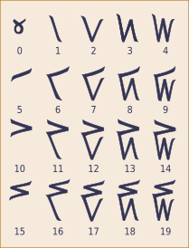

## Lesson Objectives

By the end of this lesson, you should:
- Be able to do simple math operations in binary
- Create and interpret binary representations of letters

### Today's Vocabulary:

- ASCII
- XOR
- Bit Shift

## What We'll Do In Class

### Quiz

As usual, we'll start with a reading quiz to make sure you're comfortable with the concepts that you read about for homework.

### Extension - Other number systems

I got lots of good questions last time about numbers systems - and I didn't have
the answers! So I did some more googling and found that this is a fascinating
rabbit hole.

Here are a few articles you can explore if you're interested:

- <https://dozenal.org/> - A modern american movement that says we should all use base 12 instead of base 10. They have some good points!
- <https://www.lingodigest.com/counting-in-base-20-a-world-beyond-ten/> - A summary of a bunch of different cultures that independently developed base-20 counting systems
- <https://en.wikipedia.org/wiki/Kaktovik_numerals> - one specific base-20 positional numbering system used by Alaskan Inuit groups. I've copied the relevant image from wikipedia below.
- <https://www.researchgate.net/figure/The-Oksapmin-27-body-part-counting-system-Body-parts-in-order-of-occurrence-1-tipna_fig4_228807955> - a good visualization of the base-27 "body part counting system"

### Binary Math

Now we know that binary can represent numbers.
We can do math with numbers, so we'll do a bit of that.

We'll do some addition and subtraction together. (Note - we're only using whole, positive numbers in binary, so I won't give you any subtraction problems that result in a negative answer. We're also not doing multiplication, division, fractions, or decimals.)

We'll also discuss some operations that are unique to binary:
- AND (&)
- OR (|)
- XOR (^)
- NOT (~)
- Shifts (<< and >>)

### Encoding Text in Binary

Now that you know how to use binary to represent numbers, what about text? We'll learn about the [ASCII Table](https://www.asciitable.com/) and we'll do a fun craft to practice.

## Homework

### Binary Practice

Continue practicing with binary math and ASCII.

You will not be required to memorize the ASCII table in this class (or any other CS class at this school), but we use it a lot, so you'll need to be comfortable with how it works.

Our quiz next class will cover the binary operators listed above, and a few questions about ASCII.

### No additional reading

