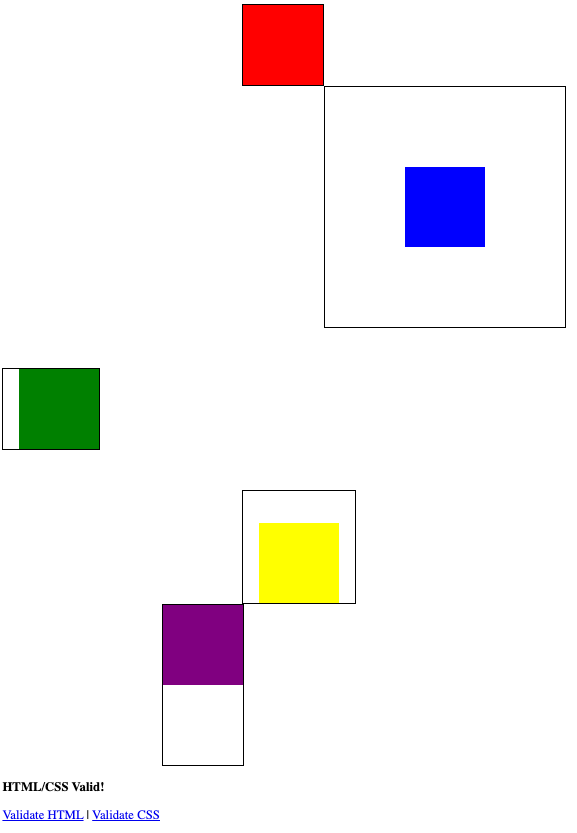

## Lesson Objectives

By the end of this lesson, you should:
- Be able to add simple styles to your HTML pages
- Be able to select and use web-safe fonts 
- Be able to adjust how much space an object takes up on the page

## What We'll Do In Class

Today's class is a grab-bag of various topics in CSS. We'll come back to 
all of these next semester.

### Reading Quiz

I don't think it's fair to do a reading quiz today. We'll practice with forms
and have a forms quiz on Thursday.

### Warm Up - Box Model Practice
I'll let you play with the box model on your own.

I want you to make a page with five different divs. Give each div an id,
and use an internal stylesheet (in the `head` tag) to style each div.

From there, try to recreate this image:

A few hints:
- The content of each box is 100px/100px
- Each box has `background-clip:content-box;` (which stops the color from
showing up on in the padding).
- Each box has `border:2px solid;`

If you need more review, here is a good resource: <https://www.w3schools.com/Css/css_boxmodel.asp>

In your repo, commit this page to: `practice/box_model.html`. Here is a 
link you can use to confirm that the auto-grader will see it: <https://specreaper.github.io/SE_Capstone_Projects/GithubFileLinksTable.html?file=practice%2Fbox_model.html>

### Forms

Together in class, we'll write our first form. We'll practice with different types of inputs and 
request methods. For each, we'll take a look at how our browser displays the form
and what kinds of HTTP requests it generates.

Then we'll play with types inputs. To practice, 
work on re-creating this Google form on your website: 
[You're Invited to an Ice Cream Party!](https://forms.gle/FT8q7ezqT3UAB2BR7)

For each input in this form, be sure to use the best available input type. You should
also:
- Use a **button**, not an input element for submit
- Include a reset
- Send the results as a POST request to this URL [https://httpbin.org/post](https://httpbin.org/post)

In your repo, commit this page to: `practice/ice_cream_form.html`. Here is a 
link you can use to confirm that the auto-grader will see it: <https://specreaper.github.io/SE_Capstone_Projects/GithubFileLinksTable.html?file=practice%2Fice_cream_form.html>

## Homework

Finish up your two practice pages: 
- `practice/box_model.html`
- `practice/ice_cream_form.html`

### Reading

We'll finally have our quiz on forms next class. In case you haven't done the 
reading yet or need a refresher, check out the reading assignment from last 
class.
