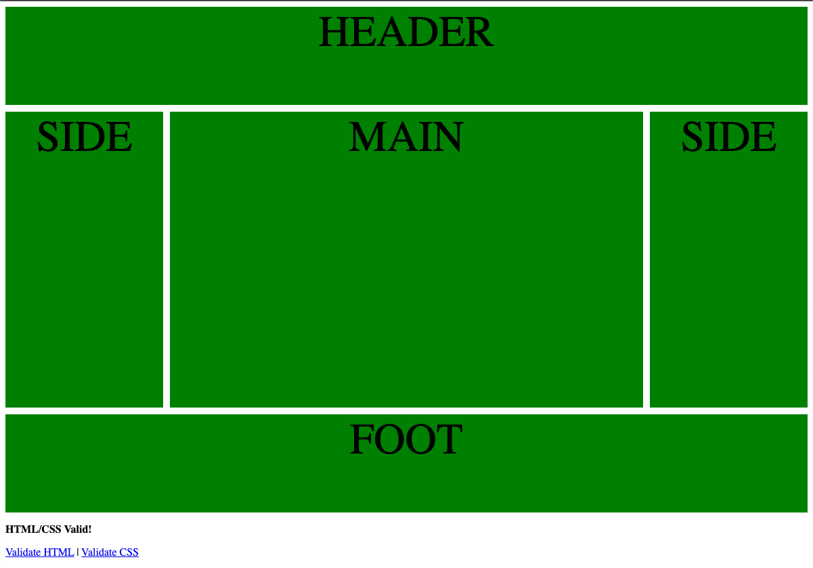

## Lesson Objectives
By the end of this lesson, you should:
- Be able to name and identify common elements of web design
- Be able to use `grid-area` and the `grid` shorthand to easily create and place items in the CSS grid

## What We'll Do In Class

### Upcoming Plans

We're in the home stretch of the semester. Between now and the end of the month, we'll work on a project and prepare for our certification exam. I'll give a quick overview of both.

### CSS Grid Shorthand

I'll expect you to know the CSS grid syntax that we learned before break (and that you can review any time on <https://cssgridgarden.com/>), but there is a very convenient shorthand that I usually prefer. 

We'll talk through the examples on this page:

<https://thoughtbot.com/blog/css-grid-shorthand>

#### CSS Grid Practice: The "Holy Grail"

To practice, we'll reproduce this screenshot using CSS grid. We'll discuss how this is a special design that is traditionally called "the holy grail" because it was tricky to create before CSS grid.

Call this file `practice/holy_grail.html`.

## Homework

### Start thinking about your project.

Your project will be to build a website for someone else. It will be due on the last day of the semester, and I'll have all the specific details next class.

For now, start thinking of who you might want to build a website for. I'll have some suggestions next class for anyone who needs ideas.

### Reading

Next class we'll start thinking about approaches to designing a website. To do that, we need to learn about design elements. Read about them here:

<https://blog.tubikstudio.com/anatomy-of-web-page/>

Our reading quiz next class will be a bit different. I'll give you a screenshot of a web page and ask you to name and identify the design elements. Here's the vocabulary from that article that is fair game:

- Header
- Footer
- Hero
- Call to Action
- Types of Menu
    - Horizontal Menu
    - Dropdown Menu
    - Megamenu
    - Hamburger Menu
- Breadcrumbs
- Cards
- Progress Indicator
- Tags

If you like this article and want to think more about design elements, I really like this other article on the same website, which has lots of great examples about how these are used.

<https://blog.tubikstudio.com/types-of-web-pages/>