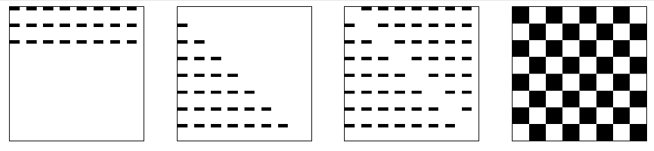

## Lesson Objectives  
By the end of this lesson, you should:

- **Be able to** Use (nested) for loops to create interesting patterns on an 
HTML canvas.

### Reading Quiz

We'll start with a short reading
quiz about the content from the reading.

### Loops, and Canvas

Next, we'll return to HTML canvas, where we'll use loops to draw
interesting patterns. 

Start by creating a directory called `practice/loops/` and then put these two file inside it:

- [practice/loops/index.html](https://raw.githubusercontent.com/cj0ne5/cj0ne5.github.io/refs/heads/main/practice/loops/index.html)
- [practice/loops/loops.js](https://raw.githubusercontent.com/cj0ne5/cj0ne5.github.io/refs/heads/main/practice/loops/loops.js)

When you open `index.html` you should see four blank canvases.

We'll work in `loops.js` to write some code, with the goal that we
get our canvases to look like this:

We'll do the first one together, and then you'll work on the rest on your own for practice.

Commit these files to your repo - this will be graded as a classwork. Do the best you can - I won't grade on perfection!

Make sure you get your filenames correct - you can [check the autograder here](https://specreaper.github.io/SE_Capstone_Projects/GithubFileLinksTable.html?file=practice%2Floops%2Floops.js)!

## No Homework

Have a wonderful spring break - it looks like the weather will be nice =)