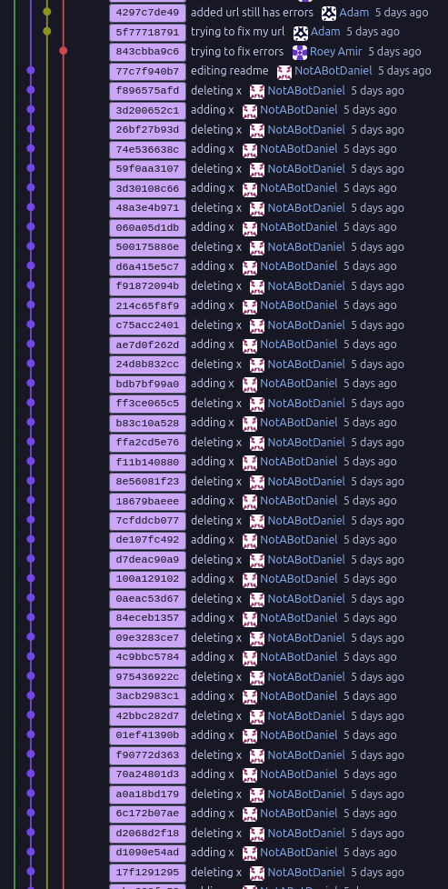

## What We'll Do In Class

### Presentations

We'll take ~10 minutes at the beginning of next class to merge PRs, and then we'll present.

### Grades

I'll give a quick update on grading. As promised, I wrote
a script to scrape issues, commits, PRs, and comments. We spent 5 class periods on this project, so I'm expecting about that much work. Here's how I assigned the grades:

- A - you made at least 5 pull requests that were accepted and merged by your team, and contributed to team processes.
- B - you made at least 3 pull requests that were accepted and merged by your team, and contributed to team processes.
- C - you made at least 2 pull requests that were accepted and merged by your team, and contributed to team processes.
- D - you made fewer than 2 PRs that were accepted amd merged by your team, or you did not meaningfully contribute to team processes
- Nobody got E's =)

As always, I'm a mortal and make mistakes. If you disagree with or have questions about the grade I gave, email me and I'll take another look!

Also quick shoutout to Daniel, who provided a great demonstration of <https://en.wikipedia.org/wiki/Goodhart's_law> with the screenshot I added at the bottom of this page.

### Project assignment

Last class, we assigned Keamlak, Adam, and Korben to the reservation project.

I took the liberty of dividing everyone else into three teams:

- Madi, Yara, Daniel, and Clara
- Gabriel, Jackson, Roey, and Adam
- Isaac, Owen, Tai-Yu, and Kidus

These will be our teams for now. I reserve the right to rearrange them as 
the projects progress!

And here are the projects we need to assign:

1. Community Lending (customer: Chris)
2. Course/Pathway Planning (customer: Dr. Van Lare)
3. Accommodations (customer: Ms. Johns)

Here's how I plan to go about this:

- Get with your team, and rank these three projects in order of how much you want them.
- If there are conflicts, we'll settle them with a [Micro Machines](https://en.wikipedia.org/wiki/Micro_Machines_(video_game)) race.

### Team Project Work

With your team, setup a new repo.

I also want each team to setup a wiki in your repo. We'll have a quick
chat about how that works.

### Start Making Plans!

Chris won't be here on Wednesday. By the time we get back next week, every team
should have at least:

- A repo, cloned on everyone's computer

- A .gitignore file that reflects all the lessons learned from last time
    - (At minimum, be sure to gitignore your db.sqlite3 file, .DS_Store, __pycache__, .venv)
- A license
- A README.md that includes each of your team members' names
- A minimal working Django that I can checkout and run
- A wiki, with at least one page summarizing your team's understanding of 
the project requirements

### Daniel's Commits

