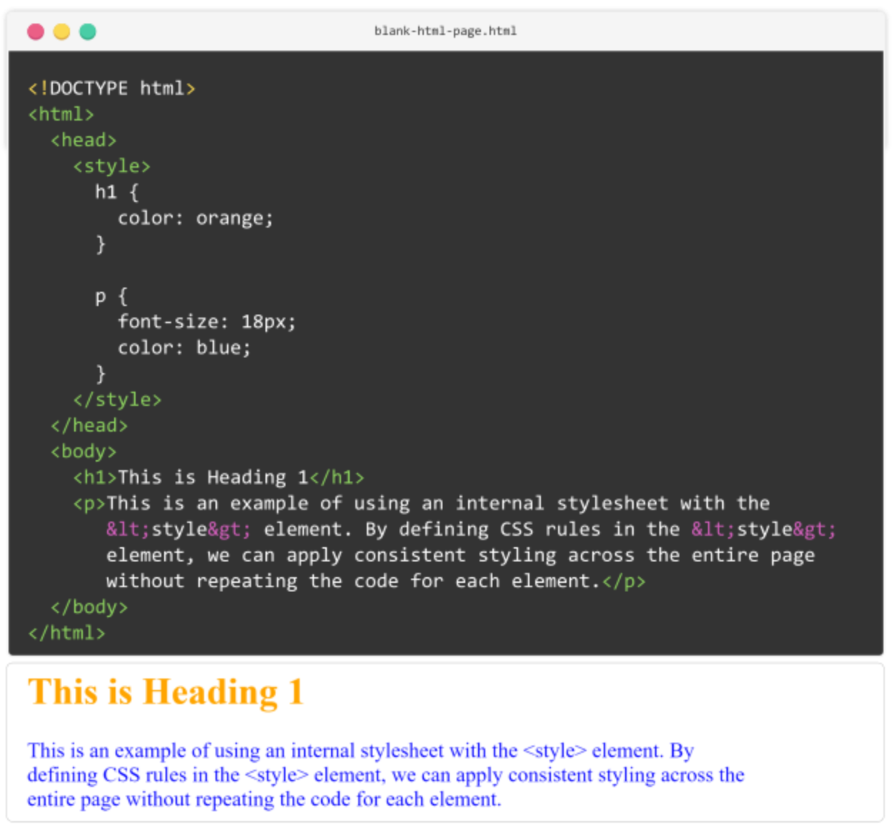

## Today's Topic

Applying Style(CSS) to our HTML page

## Lesson Objectives

By the end of this lesson, you should:

* Be able to Apply📝 Style to your html page
* Apply🛠️ the inline styling to a paragraph
* Apply🚀 the internal stylesheet to your HTML document

## What We'll Do In Class?

We will be applying CSS to our HTML page(index.html)

### What we will do before  today's class starts?

We will begin by recaping our past lessons.

If you look back at where we came from before arriving at this point, you will
relize that we have covered a lot of miles.

#### How to Apply CSS to HTML Page

In this part of our course, we're going to learn how to make our HTML pages
look nice. We'll look at two simple ways to add style directly to our HTML.

* using the style attribute right in the HTML tags (inline styling), and
* putting styles inside the HTML document with a style section 

(internal stylesheet and the &lt;style&gt; element).

CSS is actully for making the site looks nice by using CSS you 

Give some nice colors to the site.

## Homework
### Please read the first two pages in Module 3
In our <a href="https://edube.org/learn/web-dev-ess-html/html-styling-and-layout-part-1?action=page#inline-styling-and-the-style-attribute">edube.org</a>, read the few pages and apply the styling to the index.html page.

* How to Apply style to HTML Elements - Page 1
* Colors and Font Properties - Page 2

There are a lot of new styling life here, so we encourage you to make some
styling to your page  on your own to play around with them. We'll start next
class with a recaping and students,  we'll expect that you're comfortable with
everything introduced in these pages.

