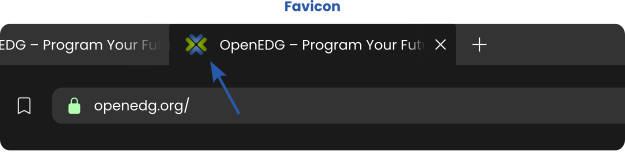

# Learning Objectives
By the end of this lesson, you should;
* Have the Understanding of Favicons
* Have the Understanding of iFrames

# What we will do in class Today?

### In class today;
* we will recape on HTML Best Practices
* we answer questions and ask questions

# What do we mean by Favicons and iFrames in Web development?

### Favicons
* A favicon is a small icon that is associated with a website.  It appears in the browser's tab or bookmark bar, providing a visual representation of the website.

### Example:

### iFrames
* iFrames (short for inline frames) are HTML elements that act as a window into another web page or document.

To create an iFrame, simply use the &lt;iframe&gt; tag in your HTML code.  It allows you to specify the source of the content you want to embed and use attributes to customize its appearance and behavior.

## Home work
Read edube Model 6, page 2 and 3
* Understanding Favicons page 2
* Understanding iFrames page 3

Read <a href="https://www.edube.org">edube.org</a>

There are a lot of new things and  way of life here, so we encourage you to make some
contents to your page on your own just to play around with them.

We'll start next class with a recaping and we'll expect that you're comfortable with everything introduced in these page

