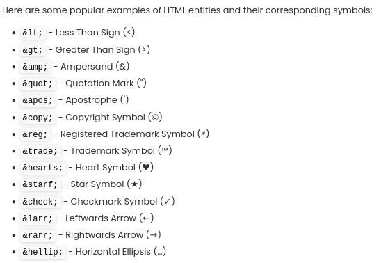
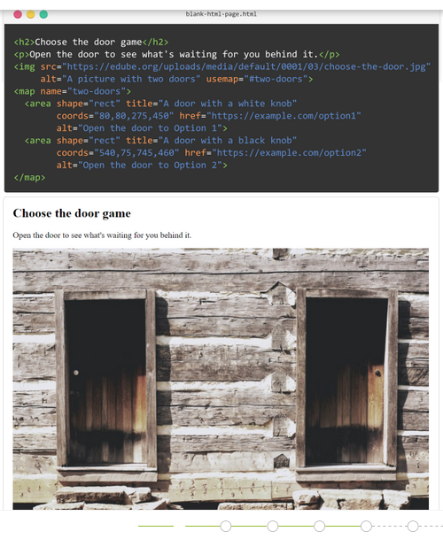

# Learning Objectives
By the end of this lesson, you should;
* Be able to understand HTML Entities
* Be able to understand Image Maps

# What we will do in class Today?

### In class today;
* we will recape on Favicons and iFrames
* we answer questions and ask questions

# What do we mean by HTML Entities and Image Maps?

### HTML Entities
* HTML entities (character entity references) are special codes that represent specific characters or symbols in HTML.

* They are used to display characters that have special meanings or cannot be directly typed or displayed in HTML. 
* They are denoted by an ampersand (&) followed by a specific code or name, and then closed with a semicolon (;).

### Example:

### Image Maps
* mage maps allow you to create interactive and clickable areas within an image to generate super features such as  interactive diagrams, clickable infographics, or dynamic navigation menus.

* How do you do it? You need to divide an image into clickable areas, called hotspots,  where each hotspot can be linked to a specific destination, such as a web page or an action.

### Example:
Here is an example of a Two Doors Image Maps. 

## Home work
Read edube Model 6, page 4 and 5
* Understanding HTML Entities page 4
* Understanding Image Maps page 5

Read <a href="https://www.edube.org/study">edube.org</a>

There are a lot of new things and  way of life here, so we encourage you to make some
contents to your page on your own just to play around with them.

We'll start next class with a recaping and we'll expect that you're comfortable with everything introduced in these page

