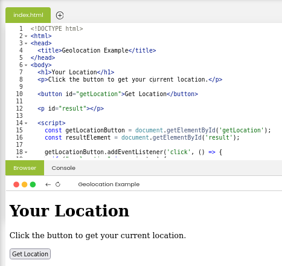
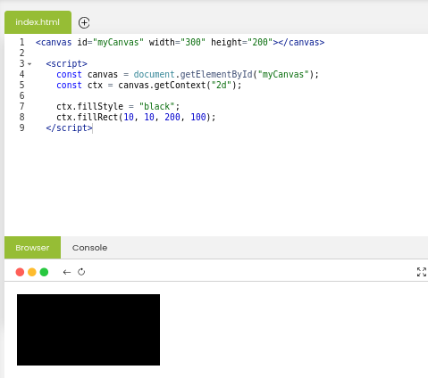

# Learning Objectives
By the end of this lesson, you should;
* Have the Understanding of HTML APIs
* and Understanding HTML Graphics

# What we will do in class Today?

### In class today;
* We will recap on HTML Entities and Image Maps
* we will ask and answer questinos from start of model 6 to last activities.

# What do we mean by HTML APIs and HTML Graphics?

### HTML APIs
* An HTML API, or Application Programming Interface, is a set of rules, protocols, and  tools that allows different software components, applications, or systems to interact and communicate with each other.

    * You can think of it as a special toolkit that helps different parts of a website talk to each other.  It allows you to add extra features and services to your web pages without starting from scratch.
    
### Example:

Example of HTML APIs using Geolocation 

### HTML Graphics
* Graphics play a crucial role in making websites look attractive and engaging. They help bring your web pages to life with colors, shapes, and animations. In HTML, there are two widely used methods for creating graphics:

    * the Canvas element (&lt;canvas&gt;), which allows you to draw and animate 2D shapes and images directly through JavaScript, and 
    Scalable Vector Graphics (SVG) (&lt;SVG&gt;), a way to include high-quality graphics that  can scale to any size without losing clarity, perfect for logos, icons, and complex illustrations.

### Example:
Examples of HTML Graphics using &lt;canvas&gt; 

## Home work
Read edube Model 6, page 6 and 7 and practice what you read on. we will look at each of our work during next class time.

* Understanding HTML APIs page 6
* Understanding HTML Graphics page 7

Read <a href="https://www.edube.org/study">edube.org</a>

There are a lot of new things and  way of life here, so we encourage you to make some
contents to your page on your own just to play around with them.

We'll start next class with a recaping and we'll expect that you're comfortable with everything introduced in these page

