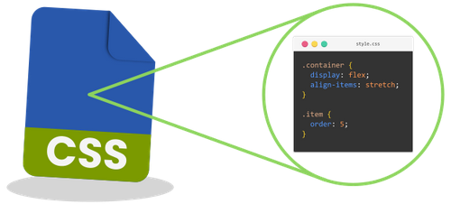

# Learning Objectives
By the end of this course, You should;
* Be able to get the clear understanding of CSS
* Be able to Apply your CSS to you Web Page.

# What we will do in class Today?

### In class today;
we will Enroll in the next course, CSS Essential
We will be Introducing our new course, part 2 of our edube.
we will lecture on our new course and its importance

### What is CSS?
* CSS (Cascading Style Sheets) is a language used to style and format the presentation of HTML elements in web documents. It provides the rules that determine how elements look and are positioned on a webpage.

### Example:

## Home work
* Read the next few pages in Module 1 of part 2 Introduction to CSS Essential and apply the CSS to your web page.

* we will check it out doing next class time.

### Read the next few pages in Part 2 Module 1
On our [edube.org](https://edube.org/) class, read the next few pages in Module 1

There are a lot of new CSS and  way of life here, so we encourage you to make some
contents to your page on your own just to play around with them.

We'll start next class with a recaping and we'll expect that you're comfortable with everything introduced in these page

