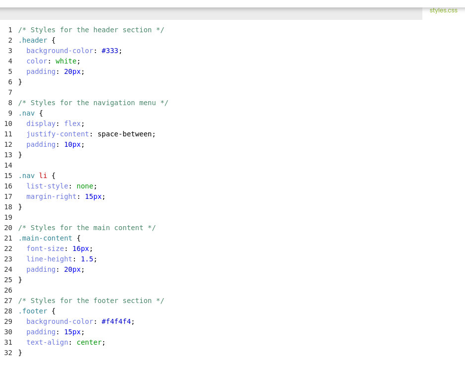
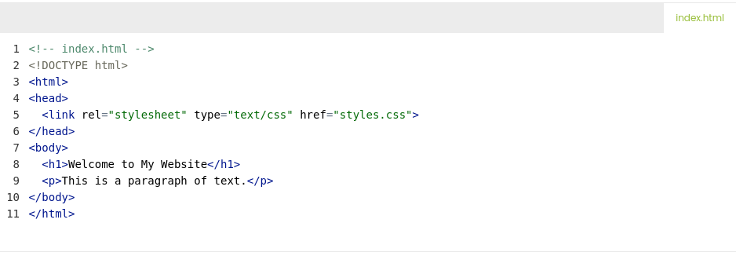

# Learning Objectives
By the end of this course, You should;
* know How to Bring CSS to Web Pages
* know Pros and Cons of Using Inline, Internal, and External Styles
* learn how to Creating and Linking External Stylesheets
# What we will do in class Today?

### In class today;
We will do a recape of what we did in our last class
We will read on "Bringing CSS to the Web Page, Pros and Cons of styling  or the Advantages and Disadvantages of styling
We will read on creating and linking external stylesheets

### What do we mean by bringing CSS to the Web?
We actually bring CSS to the Web by using three means or ways.
* 1. Inline Styling, 
* 2. Internal Styling, and 
* 3. External styling or stylesheets.

### How do we Creat and Link External Stylesheets to our Web Pages?
Creating and Linking External Stylesheets is the way of creating a separate CSS file that contains all styling rules 
and instructions for formating the visual appearance of HTML elements on the we page. 

### Example of creating External Stylesheet separately:

* Below is the aspect of connecting External Stylsheet to the HTML document. 
### Example of External Stylesheet applied to HTML document:

## Home work
* Read the next few pages in Module 1 of part 2 Introduction to CSS Essential and apply the CSS to your web page.
* Read Page 2 Bring CSS to HTML Page or Web Page,
* Read Page 3 Creating and Linging CSS.
* We will check it out doing next class time.

### Read the next few pages in Part 2 Module 1
On our [edube.org](https://edube.org/) class, read the next few pages in Module 1

There are a lot of new CSS and  way of life here, so we encourage you to make some
contents to your page on your own just to play around with them.

We'll start next class with a recaping and we'll expect that you're comfortable with everything introduced in these page

