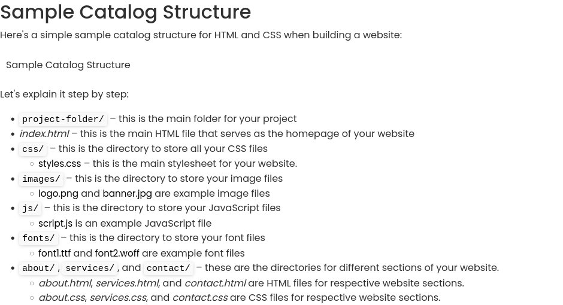
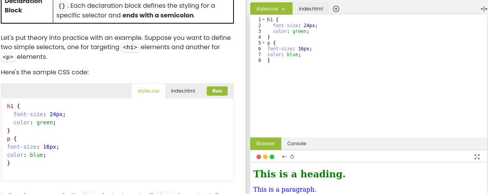

# Learning Objectives
By the end of this Module, You should;
* Be able to get the clear Understanding of Organizing Files and Dirctories,
* Master the CSS Rules.
* Understand the types of Selectors
* Get the Understanding the Cascade, Specificity, and Inheritance
# What we will do in class Today?

### In class today;
* We will do a recape of what we did in our last class
* We will ask and answer questions and out last class lesson.

### What is Organizing Files and Directories?
* When building a website, organizing your files and directories in a structured manner  can greatly enhance your development process and make it easier to manage your project.

### Example of Organizing Files and Directories:
* 

### What is a CSS Rules?
* A CSS rule, also known as a style rule, is a set of instructions that defines how a specific  HTML element or group of elements should be styled and presented on a web page. It is composed of a selector and its  associated declaration block (a set of properties and their corresponding values enclosed in curly braces).

* Below are two Selectors that have been define in our example. 
### Example of Two Selectors being defined:
* 

## Home work
* Read the last few pages in Module 1 of part 2 Introduction to CSS Essential and apply the CSS to your web page.
* Read All the pages of Module 1 because we will have a long break after today class. We will be meeting on next Firday.
* Read and do the practices, We will check it out doing next class time.

### Read the next few pages in Part 2 Module 1
On our [edube.org](https://edube.org/) class, read the next few pages in Module 1

There are a lot of new CSS and  way of life here, so we encourage you to make some
contents to your page on your own just to play around with them.

We'll start next class with a recaping and we'll expect that you're comfortable with everything introduced in these page