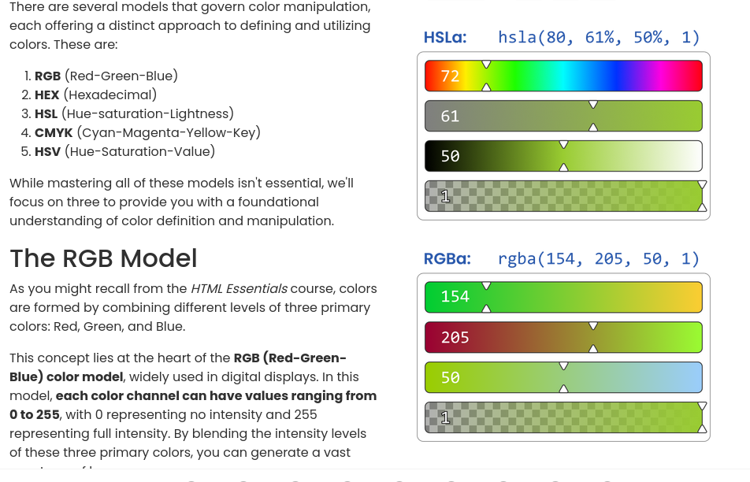

# Learning Objectives
By the end of this lesson, You should;
* Be able to understand Colors and Color Models in CSS
# What we will do in class Today?

### In class today;
We will do a recape of what we did in our last class
We will ask and answer questions and out last class lesson.

### What is colors and color Models in CSS?
* Color is the visual quality that defines how objects appear when they interact with light. It's a fundamental element of design, and in web design, we use various color models to represent and manipulate it.

### Example of Organizing Files and Directories:

### Below, we will be discussing the Various Color Models in CSS
### The HEX Model

* As you also might remember from the HTML Essentials course, the HEX model is a web-friendly extension of RGB. It employs hexadecimal notation to express colors and communicate RGB values using a combination of numbers and letters.

* In the hex model, colors are defined using a six-character code, starting with a hash symbol  (#) followed by two characters representing the intensity of red, two for green, and two for blue.  Each pair of characters represents a value in hexadecimal notation, which ranges from 00 (no intensity) to FF (maximum intensity).

* For example, pure red in RGB (rgb(255, 0, 0)) is represented as #FF0000 in the hex model. Similarly,  pure green in RGB (rgb(0, 255, 0)) is #00FF00, and pure blue in RGB (rgb(0, 0, 255)) is #0000FF.

### The HSL Model

* The HSL (Hue-Saturation-Lightness) model defines colors based on three main components: hue, saturation, and lightness.  Unlike the RGB model, which is based on additive color mixing, the HSL model approaches color in a more human-centric manner, making it easier to understand and manipulate:

* Hue – represents the actual color itself, ranging from 0 to 360 degrees on the color wheel.  It's like choosing a specific color from a circular spectrum. Red is typically at 0 degrees, green at 120 degrees, and blue at 240 degrees.
 
You can read more on the rest of the Colors Models in edube for feature understanding.
## Home work
* Read the first few pages in Module 2 of part 2 Introduction to CSS Essential and apply the CSS to your web page.
* Read the first 3 pages of Module 2
* Read and do the practices, We will check it out doing next class time.

### Read the next few pages in Part 2 Module 2
On our [edube.org](https://edube.org/) class, read the next few pages in Module 2

There are a lot of new CSS and  way of life here, so we encourage you to make some
contents to your page on your own just to play around with them.

We'll start next class with a recaping and we'll expect that you're comfortable with everything introduced in these page

