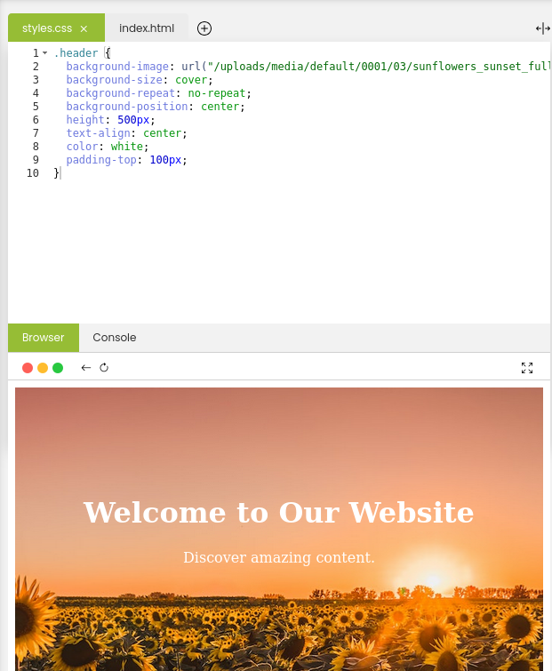
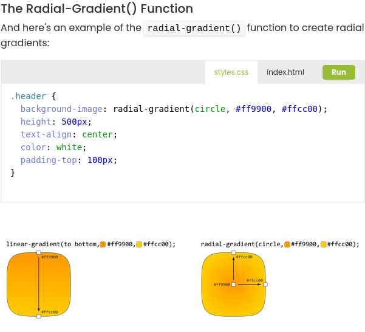
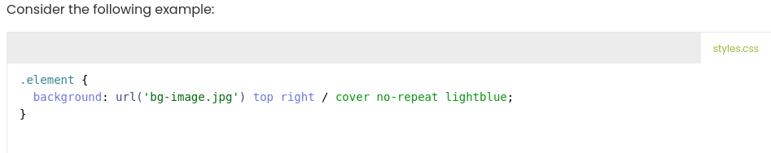
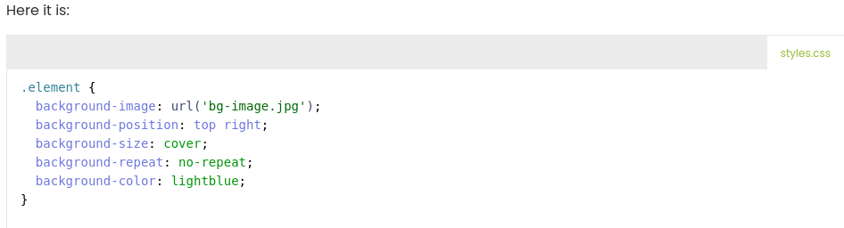

# Learning Objectives
By the end of this Module, You should;
* Understand Background Properties and Gradient Functions in CSS
* Understand Shorthand and Longhand CSS Properties
# What we will do in class Today?

### In class today;
We will do a recape of what we did in our last class
We will ask and answer questions and out last class lesson.

### What is Background Properties in CSS?
* The background of a web element plays a vital role in its visual representation.  To exercise greater control over backgrounds, CSS provides an array of background properties.  These properties allow you to set colors, images, gradients, and more as backgrounds for HTML elements.

### Example of Background Properties:

### What is Gradient Functions?
* Gradient functions are built-in tools used to generate dynamic images that display smooth transitions between two or more colors.
* In addition to background-related properties we've just discussed, there are also two interesting  functions that let you add gradients as backgrounds.  These are linear-gradient() and radial-gradient(), which you can use along with the background-image property.

### Example of gradient functions:

### What is Shorthand and Longhand CSS Properties?
* As you delve into styling, you'll encounter two categories of properties:  shorthand properties and longhand properties. Each type serves a slightly  different purpose, offering convenience or precision based on your design needs.

#### Shorthand Properties
* Shorthand properties allow you to set multiple related values within a single declaration.\
### Example of shorthand CSS properties:

#### Longhand Properties
* Longhand properties, in contrast, offer detailed control over specific aspects of an element's presentation.
* These properties are more explicit and focused, allowing you to set individual values.

### Example of Longhand CSS properties:

## Home work
* Read pages 4 & 5 in Module 2 of part 2 Introduction to CSS Essential and apply the CSS to your web page.
* Read and do the practices, We will check it out doing next class time.

### Read the next few pages in Part 2 Module 2
On our [edube.org](https://edube.org/) class, read the next few pages in Module 2

There are a lot of new CSS and  way of life here, so we encourage you to make some
contents to your page on your own just to play around with them.

We'll start next class with a recaping and we'll expect that you're comfortable with everything introduced in these page

