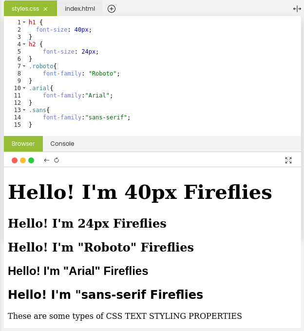
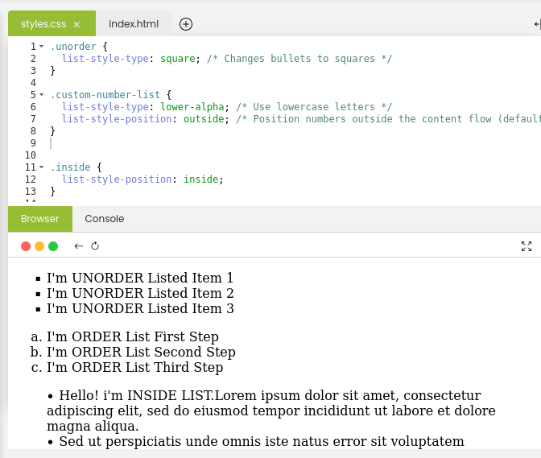

# Learning Objectives
By the end of this Module, You should;
* Understand the CSS Text Styling Property
* get the Understanding of List Types

# What we will do in class Today?

### In class today;
We will do a recape of what we did in our last class
We will ask and answer questions and out last class lesson.

### Why CSS Text Styling Properties?

CSS offers a wide range of tools to control how HTML elements look.  Some properties and values are especially important for styling web pages.

In this section, our primary focus will be on text styling, encompassing font and text properties.  These elements play a pivotal role in defining the look of text on your web pages.  You'll gain proficiency in modifying font family, size, color, alignment, and various other attributes.

### Example of Background Properties:

### What are List Properties?
List properties are valuable for both aesthetics and usability. Effective list styling not only reinforces your website's visual identity but also elevates readability,  facilitating content scanning and comprehension for users. Using consistent list styles across your entire  website will reinforce a sense of cohesion and refinement in the design.

### Example of Longhand CSS properties:

## Home work
* Read pages 6 & 7 in Module 2 of part 2 Introduction to CSS Essential and apply the CSS to your web page.
* Read and do the practices, We will check it out doing next class time.

### Read the next few pages in Part 2 Module 2
On our [edube.org](https://edube.org/) class, read the next few pages in Module 2

There are a lot of new CSS and  way of life here, so we encourage you to make some
contents to your page on your own just to play around with them.

We'll start next class with a recaping and we'll expect that you're comfortable with everything introduced in these page

