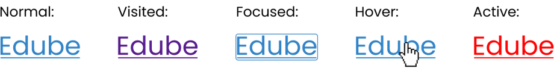

# Learning Objectives
By the end of this Module, You should;
* Understand the Hyperlink Properties and the Five Link States.
* get the Understanding of Essential Image properties

# What we will do in class Today?

### In class today;
We will do a recape of what we did in our last class
We will ask and answer questions and out last class lesson.

### What is Hyperlink Properties and its Five Link States?
Hyperlinks, or links, are fundamental elements in web design, connecting various parts of the web and guiding users through your website. Styling hyperlinks with CSS enhances usability and ensures they fit seamlessly into your site's design.

### The Five Link States
When styling links in CSS, it's crucial to grasp the concept of link states and understand how to employ pseudo-classes.

You probably remember from the previous sections that pseudo-classes are keywords that allow you to target and style elements based on their states or positions within the document.  They are: Normal, Visited, Focus, Hover, Active.

Below are the Five Link States in Action!
### Example of hyperlink Properties:

### What are Essential Image Properties?
as you know, images in web development refer to graphic or visual content displayed on a webpage.  These images can be photographs, illustrations, icons, logos, or any other type of visual content that enhances the user experience or conveys information.

 CSS image properties offer a range of options for controlling the size, alignment,  and appearance of images on a webpage. Let's explore some of the most commonly used ones.

## Home work
* Read the last two pages in Module 2 of part 2 Introduction to CSS Essential and apply the CSS to your web page.
* Read and do the practices, We will check it out doing next class time.

### Read the next few pages in Part 2 Module 2
On our [edube.org](https://edube.org/) class, read the next few pages in Module 2

There are a lot of new CSS and  way of life here, so we encourage you to make some
contents to your page on your own just to play around with them.

We'll start next class with a recaping and we'll expect that you're comfortable with everything introduced in these page

