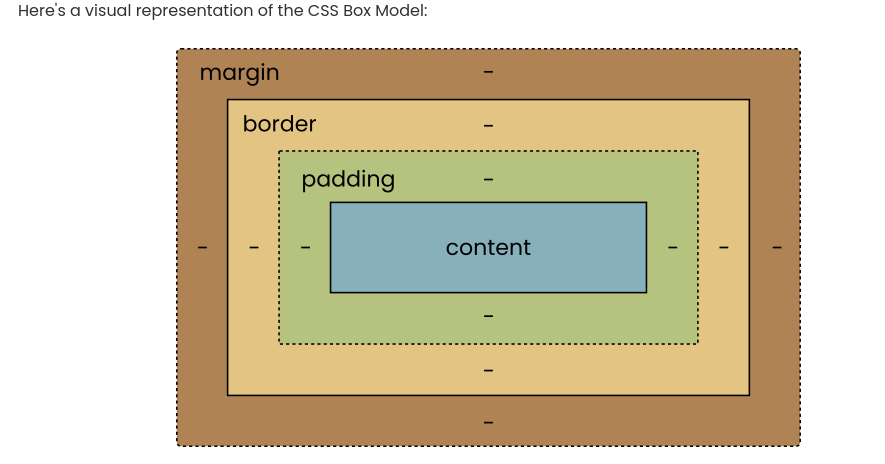
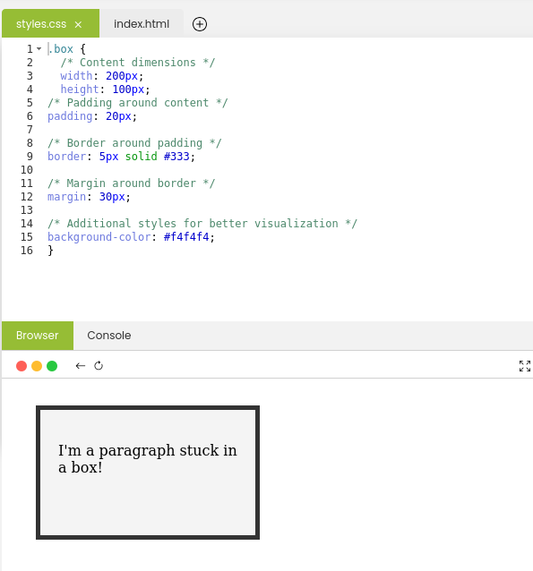

# This is our last meeting today for this class. 
* I actually appreciate you guys for your commitment to the lesson and times, effort, and making it your top priority to attend each one of the classes that comes after the next.

* It was very wonderful and amazing working with you all. hope to see you again! 

# What we will do in class Today?

### In class today;
We will do a recape of what we did in our last class
We will ask and answer questions and out last class lesson.

### What do we meant by HTML Elements as Boxes?
* When working with HTML and CSS, it's incredibly helpful to think of HTML elements as boxes. This concept, known as the Box Model, simplifies the way we apply styles and layout properties to elements on a web page.

* Imagine each element on your webpage as a unique box. These boxes have their own distinct properties that define how they look, how much space they occupy, and how they interact with other boxes on the page. Just like real boxes, these HTML element boxes can be nested within each other, creating a hierarchical structure that influences the overall layout of your webpage.

### The CSS Box Model
* In essence, the CSS Box Model defines the properties of the rectangular boxes that surround every HTML element. It consists of four essential components:
* 1. Margin
* 2. Border
* 3. Padding
* 4. Content

### Example of CSS BOX Model:

### What are Box Model Essentials?
* In the previous section, we introduced the CSS Box Model, which consists of four key components: content, padding, border, and margin. Now, let's explore each of these components in depth.
Below are the four essential components.

### Example of boxmodelessentails:

## Home work
* Read the first two pages in Module 3 of part 2 Introduction to CSS Essential and apply the CSS to your web page.
* Read and do the practices.

### Read the first two pages in Part 2 Module 3
On our [edube.org](https://edube.org/) class, read the first two pages in Module 3

There are a lot of new CSS and  way of life here, so we encourage you to make some
contents to your page on your own just to play around with them.
