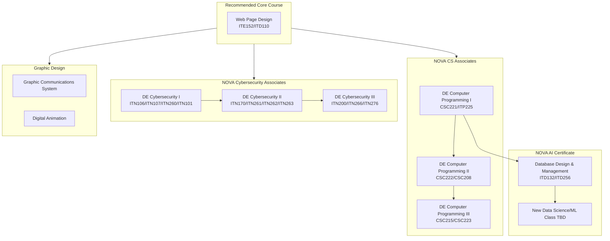

# New IT/Cybersecurity/Data Science Programs

We would like to offer this program here at Arlington Tech: [Information Systems Technology, A.A.S.](https://catalog.nvcc.edu/preview_program.php?catoid=15&poid=3799&returnto=1877) . See below for an analysis of the courses required for this program

In addition, we would like to explore:
* [Information Systems Technology: Artificial Intelligence and Data Analytics, C.S.C.](https://catalog.nvcc.edu/preview_program.php?catoid=15&poid=3835&returnto=1877)
	* For this one, we'd need to add a few new data science courses
* [Cybersecurity, A.A.S.](https://catalog.nvcc.edu/preview_program.php?catoid=15&poid=3745)
	* We don't currently offer Cyber III, and there is one course that would still be missing after that: [ITN 276: Computer Forensics I](https://catalog.nvcc.edu/preview_program.php?catoid=15&poid=3745#)

(Note that this page includes only the courses that are unique to these three pathways. It does not include general education requirements or electives that are already covered in our other AS Pathways.)
## Proposed Changes
To accommodate all of this, I'm proposing these changes:

- Remove [ITD 210: Web Design II](https://www.nvcc.edu/dist/files/sites/academics/summaries/ITD210.pdf) from DE Web Design
- Move [ITE 152: Intro to Digital and Information Literacy](https://www.nvcc.edu/dist/files/sites/academics/summaries/ITE152.pdf) from DE Cyber I to DE Web Design
	- This better-aligns with the content we're already teaching in this class, and with AP CS Principles
- Satisfy requirements for AAS IT in two years of Cyber, instead of three:
	- Move [ITN 260: Network Security Basics](https://www.nvcc.edu/dist/files/sites/academics/summaries/ITN260.pdf) from DE Cyber II to DE Cyber I
		- ITN 260 can be co-requisite with [ITN 101: Intro to Network Concepts](https://www.nvcc.edu/dist/files/sites/academics/summaries/ITN101.pdf)
	- Move [ITN 170: Linux System Administration](https://www.nvcc.edu/dist/files/sites/academics/summaries/ITN170.pdf) from DE Cyber III to DE Cyber II
* Complete AAS Cybersecurity:
	* Add [ITN 276: Computer Forensics I](https://catalog.nvcc.edu/preview_program.php?catoid=15&poid=3745#) to DE Cyber III
* Swap One Course in DE Database:
	* Remove [ITE 140: Spreadsheeting for Business](https://www.nvcc.edu/dist/files/sites/academics/summaries/ITE140.pdf), Add [ITD 132: SQL](https://www.nvcc.edu/dist/files/sites/academics/summaries/ITD132.pdf)

### Proposed New Flow Chart
If we made all the changes proposed above, here's what the course flow chart would look like:

## Courses Required for AAS IT

| Course                                                                                                                               | Notes                                                                                                                                                                                                                                                                                                                                                                                                                                                                             |
| ------------------------------------------------------------------------------------------------------------------------------------ | --------------------------------------------------------------------------------------------------------------------------------------------------------------------------------------------------------------------------------------------------------------------------------------------------------------------------------------------------------------------------------------------------------------------------------------------------------------------------------- |
| ITD 110 - Web Page Design I (3 CR.)                                                                                                  | I already teach this in DE Web Design                                                                                                                                                                                                                                                                                                                                                                                                                                             |
| ITE 152 - Introduction to Digital and Information Literacy and Computer Applications (3 CR.)                                         | Alice already teaches this in DE Cyber 1                                                                                                                                                                                                                                                                                                                                                                                                                                          |
| ITN 100 - Introduction to Telecommunications (3 CR.) OR ITN 101 - Introduction to Network Concepts (3 CR.)                           | Alice already teaches ITN 101 in DE Cyber 1                                                                                                                                                                                                                                                                                                                                                                                                                                       |
| MTH 154 - Quantitative Reasoning (3 CR.) OR MTH 155 - Statistical Reasoning (3 CR.) OR Higher                                        | Gerri already teaches Quantitative Reasoning. MTH 245/246 (Statistics I/II) should also meet this requirement.                                                                                                                                                                                                                                                                                                                                                                    |
| ITE 170 - Multimedia Software (3 CR.)                                                                                                | This one is the hangup, and we think that Credit for Prior Learning is the best path. This probably aligns well with John Woodhead's Graphic Communication Systems class, which is not DE, but does culminate in [Adobe certification](https://www.nvcc.edu/admissions/cpl.html). There is no certification currently listed on the CPL website for this course, but we recently went through this process for another course and feel confident that we could get this approved. |
| ITN 170 - Linux System Administration (3 CR.)                                                                                        | We don't currently offer this, but it would be included in Cyber 3. Jeff has offered to teach this.                                                                                                                                                                                                                                                                                                                                                                               |
| ITN 260 - Network Security Basics (3 CR.)                                                                                            | Alice already teaches this in DE Cyber 2                                                                                                                                                                                                                                                                                                                                                                                                                                          |
| ITP 100 - Software Design (3 CR.)                                                                                                    | We don't currently offer this. Our proposal would be to ask Nova to accept ITP225 instead of this.                                                                                                                                                                                                                                                                                                                                                                                |
| ITD 256 - Advanced Database Management (3 CR.)                                                                                       | I teach this as part of DE Databases                                                                                                                                                                                                                                                                                                                                                                                                                                              |
| ITN 107 - Personal Computer Hardware and Troubleshooting (3 CR.) OR ITE 221 - Personal Computer Hardware and OS Architecture (3 CR.) | Alice teaches ITN107 as part of DE Cyber I                                                                                                                                                                                                                                                                                                                                                                                                                                        |
